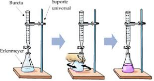

# Preparo e Padronização de Soluções Ácidas e Básicas
## Uversidade Federal do Recôncavo da Bahia 
### Centro de Formação de Professores 

>A titulação é uma técnica que tem por objetivo determinar a concentração na análise volumétrica, a solução de concentração conhecida é chamada de solução titulante e a solução que desejar-se a determinar a concentração é a solução titulada, sendo uma solução ácida e outra base.

  O procedimento químico de **preparação de soluções** tem caracteristicas unias de cada metodo ou proedimento utilizado para o desenvolvimento. Primeiramente para desenvolver esse procedimento lavou-se a bureta com [água](https://www.google.com/search?sxsrf=ALeKk01LdG-MnJHXdaPVjGyidmyxDm7Fkw%3A1615396922897&ei=OgBJYOGTNofC5OUPweGZYA&q=siginificado+agua&oq=siginificado+agua&gs_lcp=Cgdnd3Mtd2l6EAMyBAgAEA0yBAgAEA0yBAgAEA0yBAgAEA0yBAgAEA0yBAgAEA0yBAgAEA0yBAgAEA0yBAgAEA0yCAgAEAcQChAeOgQIABBHOgcIIxCwAxAnOgcILhCwAxBDOgcIABCwAxBDOgYIABAHEB46BggAEA0QHlC9Nli3UGD8UmgBcAR4AIABowaIAYUhkgEKMi0xMS4yLjYtMZgBAKABAaoBB2d3cy13aXrIAQrAAQE&sclient=gws-wiz&ved=0ahUKEwjhmIq-nqbvAhUHIbkGHcFwBgwQ4dUDCA4&uact=5) destilada e fez ambiente lavar duas vezes com pequenas porções de _3 mL aproximadamente cada, da solução de NaOH em 0,1mol por L_ e desprezou-se as lavagens, em seguida foi fixado a bureta no suporte universal, logo após com o auxílio do funil de colo curto superlotou a bureta com `solução de NaOH` até a marcação acima do zero mL, posteriormente retirou-se todas bolhas de ar contidas na bureta para que não houvesse alteração no resultado, em seguida de forma vagarosamente abriu a torneira da bureta de deixou escoar a solução até que a parte inferior do menisco coincidisse com zero mL.
  Nos procedimentos a seguir serão abordados os materias utilizados, imagem do procedimento e tabela dos resultados.
  
  ## Lista de Matériais utilizados
- Garra
- Bureta
-  Suporte Universal
- lermaier

## Imagem do Procedimento

## Tabla dos resultados da Padronização
| Formula       |  Resultados |
| ------------- |-------------|
| %m=m1/mT      | 440,30g     |
| Ci . Vi = Cf . Vf |0,4mL    |
